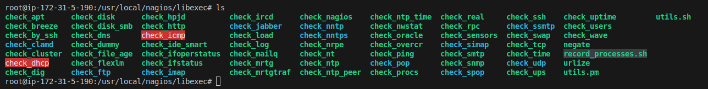
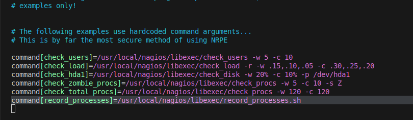
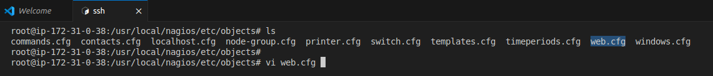
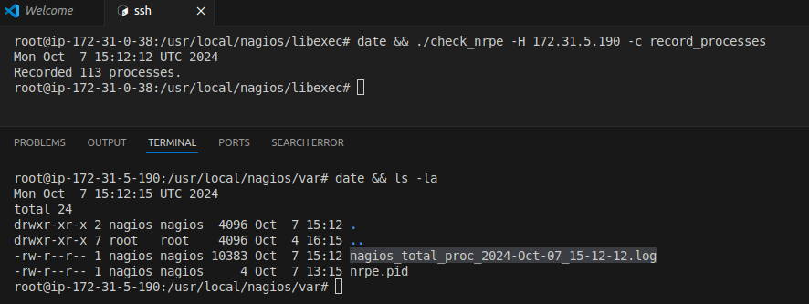
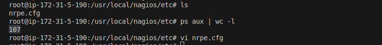
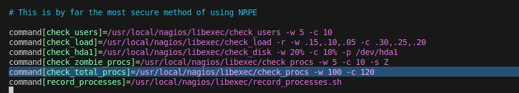
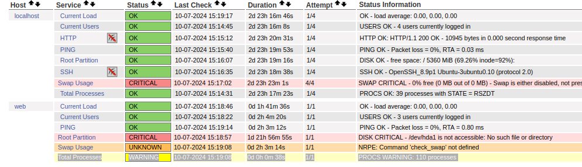
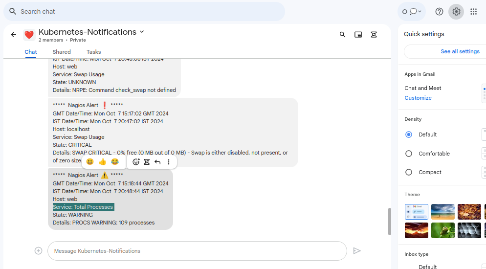
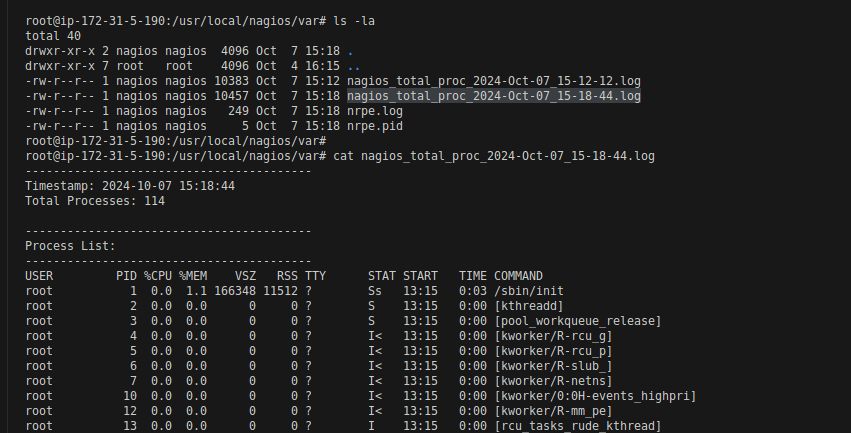

# Task: Listing Running Processes when Exceeding the Total Process Threshold in Nagios

## Objective
Configure Nagios to list all running processes when an alert is triggered due to the total number of processes exceeding the defined threshold.

## Purpose
By listing the running processes, administrators can quickly identify which processes might be consuming resources or causing the process count to exceed the threshold. This enables faster resolution of the issue.

## Plan
We will achieve this by utilizing **Nagios event handlers**.

- **Event handlers** in Nagios are commands executed in response to a specific event or state change of a host or service. 
- They allow you to take a specific action when a particular event occurs, such as sending a notification, restarting a service, or running a script.

Event handlers are triggered when a host or service state changes (e.g., from `OK` to `WARNING`, `CRITICAL`, or `UNKNOWN`).

### Example Use Cases for Event Handlers
* Send an email or SMS alert to a user or group.
* Restart a service that has become critical.
* Execute a custom script to perform a specific task.


### Steps

#### Step 1: Create a Script on the Remote Server in nagios plugin dir. ;  ( server name is Web  )

```
root@ip-172-31-5-190:/usr/local/nagios/libexec# touch record_processes.sh
```

- Add Following Contents & modify log directory if required : 

```bash
#!/bin/bash

# Define the log directory and log file with desired naming convention
LOG_DIR="/usr/local/nagios/var"
LOG_FILE="$LOG_DIR/nagios_total_proc_$(date '+%Y-%b-%d_%H-%M-%S').log"

# Check if the log directory exists; if not, create it
if [ ! -d "$LOG_DIR" ]; then
    mkdir -p "$LOG_DIR"
    echo "Log directory created: $LOG_DIR"
fi

# Get the current date and time
TIMESTAMP=$(date "+%Y-%m-%d %H:%M:%S")

# Capture the total number of processes
TOTAL_PROCS=$(ps aux | wc -l)

# Capture the full list of processes
PROCESS_LIST=$(ps aux)

# Log the information to the designated log file
{
    echo "-----------------------------------------"
    echo "Timestamp: $TIMESTAMP"
    echo "Total Processes: $TOTAL_PROCS"
    echo ""
    echo "-----------------------------------------"
    echo "Process List:"
    echo "-----------------------------------------"
    echo "$PROCESS_LIST"
    echo "-----------------------------------------"
} >> "$LOG_FILE"

echo "Recorded $TOTAL_PROCS processes."  # This line is crucial for NRPE output
exit 0

```

- Above Script will capture Total Process Count and lIst of the process.

**Make the Script Executable:**

```
chmod +x record_processes.sh
````


**Edit the NRPE Configuration:** Add a command definition for your script in the `/usr/local/nagios/etc/nrpe.cfg` file:

```bash
command[record_processes]=/usr/local/nagios/libexec/record_processes.sh
```
```bash
root@ip-172-31-5-190:/usr/local/nagios/etc# pwd
/usr/local/nagios/etc

root@ip-172-31-5-190:/usr/local/nagios/etc# ls
nrpe.cfg
```


- Save & Exit 

**Restart NRPE Service :**   
```bash
sudo systemctl restart nrpe 
```

### Implement Log rotation for this log files :

we will configure **logrotate** to automatically manage, compress, and delete old log files.

- Create file in `/etc/logrotate.d/` dir.

```bash
touch nagios_process_logs
```
Add following content in the `nagios_process_logs`

```bash
/usr/local/nagios/var/nagios_total_proc_*.log {
   missingok
   rotate 10             # Keep the last 10 logs
   daily                 # Rotate daily
   dateext               # Add date to the rotated file
   notifempty            # Do not rotate if the log is empty
   compress              # Compress old log files
   delaycompress         # Delay compression until the next rotation
}
```
- Save & Exit


#### Step 2 :  On Nagios Server

- On Nagios Server , Do Following Part for our Remote server,  name : Web:

**Define a Command:** In your Nagios configuration (typically `commands.cfg`), define a following command :

```bash
define command {
    command_name    handle_process_alert
    command_line    $USER1$/check_nrpe -H $HOSTADDRESS$ -c record_processes
}
```

Now in next part we will use this command to trigger action on remote server to execute our script `record_processes.sh` using Event Handler

##### Edit  remote server configuration file: 

- In my case it is `web.cfg` for my server and add following lines for  `Total Processes` service check

```bash
    event_handler            handle_process_alert    ; Set the event handler
    event_handler_enabled    1                       ; Ensure event handler is enabled
```


```bash
define service {

    use                     local-service           ; Name of service template to use
    host_name               web
    service_description     Total Processes
    check_command           check_nrpe!check_total_procs
    event_handler           handle_process_alert          ; Set the event handler
    event_handler_enabled   1                             ; Ensure event handler is enabled
    notifications_enabled   1 
    check_interval          0.2      ; Check every 1 minute
    retry_interval          0.2      ; Retry every 15 seconds if the first check fails
    max_check_attempts      1        ; Number of attempts before considering the host down
    check_period            24x7     ; Ensure checks are active all the time
}
```

- Save & Exit

##### Restart Nagios  : 

```bash
sudo systemctl restart nagios
```

#### Test

**Trigger an Alert:** you can run the command manually using `check_nrpe` to see if it works.




- You can also simulate an alert temp. adjusting the threshold of `Total Process` check on Web Server.





**Restart nrpe service** 
```bash
sudo systemctl restart nrpe
```
wait for alert 





**Check Logs:** Verify that the script runs and logs the process count and list in the designated log file on the remote server.

